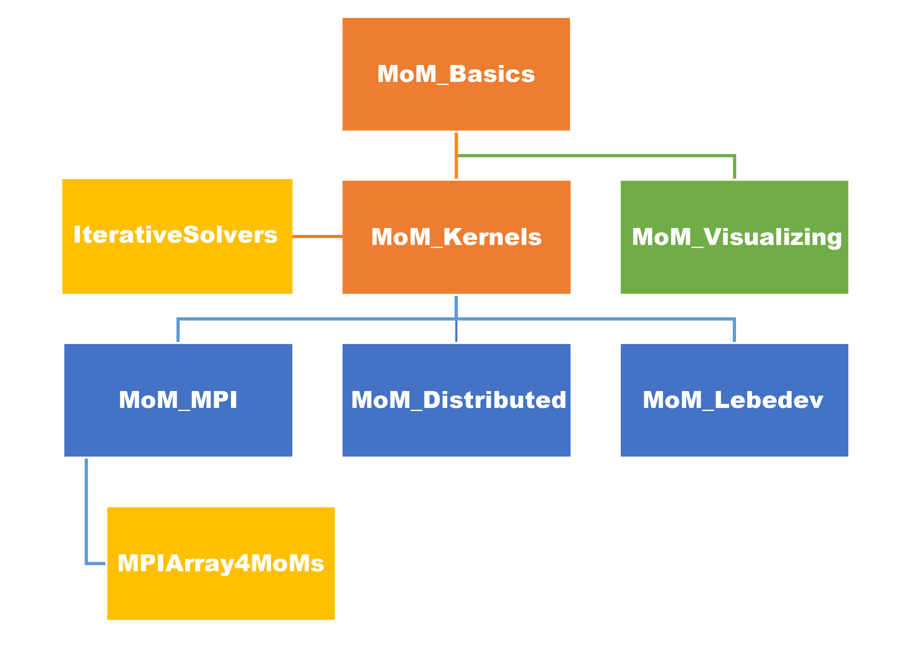

# JuMoMs

#### 介绍
本包提供矩量法+多层快速多极子的几个包的集成。

#### 软件架构
JuMoM程序的基本构成如下图所示:程序建立在Julia编程语言基础上，并根据功能拆分为数个子程序包。主要子程序包与其功能如下：
* MoM\_Basics：提供网格文件、基函数处理相关基础功能；
* MoM\_Kernels：提供矩阵、多层快速多极子构建和求解相关功能；
* MoM\_Visualizing：提供绘图等后处理可视化功能；
* MoM\_MPI：提供基于MPI的分布式并行计算功能；
* MoM\_Distributed：提供基于Julia原生分布式并行计算功能，目前并不推荐使用，未进行开源；
* MoM\_Lebedev：提供基于Lebedev球面矢量插值的计算功能；

#### 安装教程

1. 在本地安装 Julia，可参照 [Julia 中文社区相关指引](https://discourse.juliacn.com/t/topic/159)，建议配合 [VScode](https://code.visualstudio.com/) 与 [Julia 插件](https://marketplace.visualstudio.com/items?itemName=julialang.language-julia)使用；

2. 将本包下载或git clone 到本地：

    ```powwershell
    git clone https://gitee.com/deltaeecs/JuMoMs.git
    ```

3. 在本包路径下（xxx/JuMoMs）运行如下命令安装相关依赖包：

    ```powwershell
    julia -t 8 deps/install.jl
    ```

4. 测试，在包目录进入 Julia REPL (VScode 中快捷键为连按 alt+j, alt+o)：

    ```julia
    julia> 
    ```

    进入包管理（Pkg）模式（REPL中空白行输入`]`），输入

    ```julia
    (@v1.8) pkg> activate .
    ```

    激活 JuMoMs 环境。

    输入:

    ```julia
    (JuMoMs) pkg> test
    ```

    将自动运行[examples](./examples/)文件夹中的8个测试程序，并绘图比较与 Feko 的结果，图片保存在[figures](./figures/)文件夹中。

#### 使用说明

1.  参见[examples](./examples/)文件夹中的8个测试程序。
2.  xxxx

#### 参与贡献

1.  Fork 本仓库
2.  新建 Feat_xxx 分支
3.  提交代码
4.  新建 Pull Request

#### TODO

+ 为各包编写文档
+ 丰富后处理函数
  + 远场3D可视化
  + 近场计算、可视化
  + 远场、近场快算法
+ 更多激励源、端口定义
+ 其它类型积分方程
  + PMCHW
+ 各向异性介质处理
+ 特征模(CM)


#### 特技

1.  使用 Readme\_XXX.md 来支持不同的语言，例如 Readme\_en.md, Readme\_zh.md
2.  Gitee 官方博客 [blog.gitee.com](https://blog.gitee.com)
3.  你可以 [https://gitee.com/explore](https://gitee.com/explore) 这个地址来了解 Gitee 上的优秀开源项目
4.  [GVP](https://gitee.com/gvp) 全称是 Gitee 最有价值开源项目，是综合评定出的优秀开源项目
5.  Gitee 官方提供的使用手册 [https://gitee.com/help](https://gitee.com/help)
6.  Gitee 封面人物是一档用来展示 Gitee 会员风采的栏目 [https://gitee.com/gitee-stars/](https://gitee.com/gitee-stars/)
